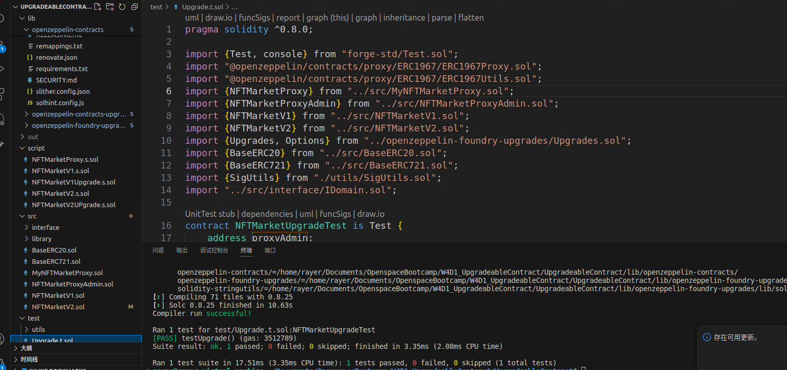

# 实现⼀个可升级的 NFT 市场合约：
• 实现合约的第⼀版本和这个挑战 的逻辑一致。
• 逻辑合约的第⼆版本，加⼊离线签名上架 NFT 功能⽅法（签名内容：tokenId， 价格），实现⽤户⼀次性使用 setApproveAll 给 NFT 市场合约，每个 NFT 上架时仅需使⽤签名上架。

需要部署到测试⽹，并开源到区块链浏览器，在你的Github的 Readme.md 中备注代理合约及两个实现的合约地址。

# 要求：

有升级的测试用例（在升级前后状态不变）
有运行测试的日志或截图
请提交你的 github 仓库地址。


## 测试用例截图



| Contract                    | Addree                                     |
| --------------------------- | ------------------------------------------ |
| NFTMarketV1                 | 0x38D85C8307D119f14E60e132D7C9274Ba79DCa09 |
| NFTMarketV2                 | 0xde6f974ab4f49683b24719F014B1A40693b1d35e |
| TransparentUpgradeableProxy | 0xba6464F22959a9628920D27FdF1F1Acbb4Cd491E |
| ProxyAdmin                  | 0x90dC6ee5d254d84154f7a4577fC4a27911a1af55 |

```solidity
NFTMarketV1
Traces:
  [487267] NFTMarketV1Script::run()
    ├─ [0] VM::broadcast()
    │   └─ ← [Return] 
    ├─ [448886] → new NFTMarketV1@0x38D85C8307D119f14E60e132D7C9274Ba79DCa09
    │   └─ ← [Return] 2242 bytes of code
    ├─ [0] console::log(NFTMarketV1: [0x38D85C8307D119f14E60e132D7C9274Ba79DCa09]) [staticcall]
    │   └─ ← [Stop] 
    └─ ← [Stop] 

Script ran successfully.
Gas used: 508331

== Logs ==
  0x38D85C8307D119f14E60e132D7C9274Ba79DCa09

If you wish to simulate on-chain transactions pass a RPC URL.
```

```solidity
NFTMarketV2
Deployer: 0xceD0324969581Fe73b5c867d1aAC8E2e33d0946E
Deployed to: 0xde6f974ab4f49683b24719F014B1A40693b1d35e
Transaction hash: 0x1845c48b4c4c76d77d954fa8f5969ffc9e3bb5d835e302e80f4a5f6ac78f72a1
```

```solidity
ProxyAdmin
Deployer: 0xceD0324969581Fe73b5c867d1aAC8E2e33d0946E
Deployed to: 0x90dC6ee5d254d84154f7a4577fC4a27911a1af55
Transaction hash: 0x45881cb04fee5af13b64cf71200462b9a91cc1fd8476263a1252073f07f41eaa
```

```solidity
Trans
Deployer: 0xceD0324969581Fe73b5c867d1aAC8E2e33d0946E
Deployed to: 0xba6464F22959a9628920D27FdF1F1Acbb4Cd491E
Transaction hash: 0xc037bb708184ddb5f7c7f0b13e69c0506e28efcc1235e6e870ca6d84135f0052
```

# first_revise

- 批注

升级合约构造函数不可用。
白名单并不是 permit 授权，需要自己设计签名逻辑，并且应该在 NFTMarket 中进行验签。

```solidity
NFTMarketV2
Deployer: 0xceD0324969581Fe73b5c867d1aAC8E2e33d0946E
Deployed to: 0x1580139A867576C4c4db079cc14aF791C13BAE87
Transaction hash: 0x1afc61ae0cb0e0303265d300e8de013d2a79ed1d49d1445bfaaebd6583ec698f
```

* 修改了permitList

```solidity
    function _permitList(
        address owner,
        address spender,
        address contractAddress,
        uint256 price,
        uint256 tokenId,
        uint256 deadline,
        uint8 v,
        bytes32 r,
        bytes32 s
    ) internal {
        // NFTContract = new NFTContract()
        nftContract = BaseERC721(contractAddress);
        _permitVaild(owner, spender, tokenId, deadline, v, r, s);

        list(contractAddress, tokenId, price);
    }

    function _permitVaild(
        address owner,
        address spender,
        uint256 value,
        uint256 deadline,
        uint8 v,
        bytes32 r,
        bytes32 s
    ) public virtual {
        if (block.timestamp > deadline) {
            revert ExpiredSignature(deadline);
        }
        bytes32 structHash = keccak256(
            abi.encode(_PERMIT_TYPEHASH, owner, spender, value, value, deadline)
        );
        bytes32 hash = _hashTypedDataV4(structHash);
        address signer = ECDSA.recover(hash, v, r, s);
        if (signer != owner) {
            revert InvalidSigner(signer, owner);
        }
    }
```

## 测试用例截图


